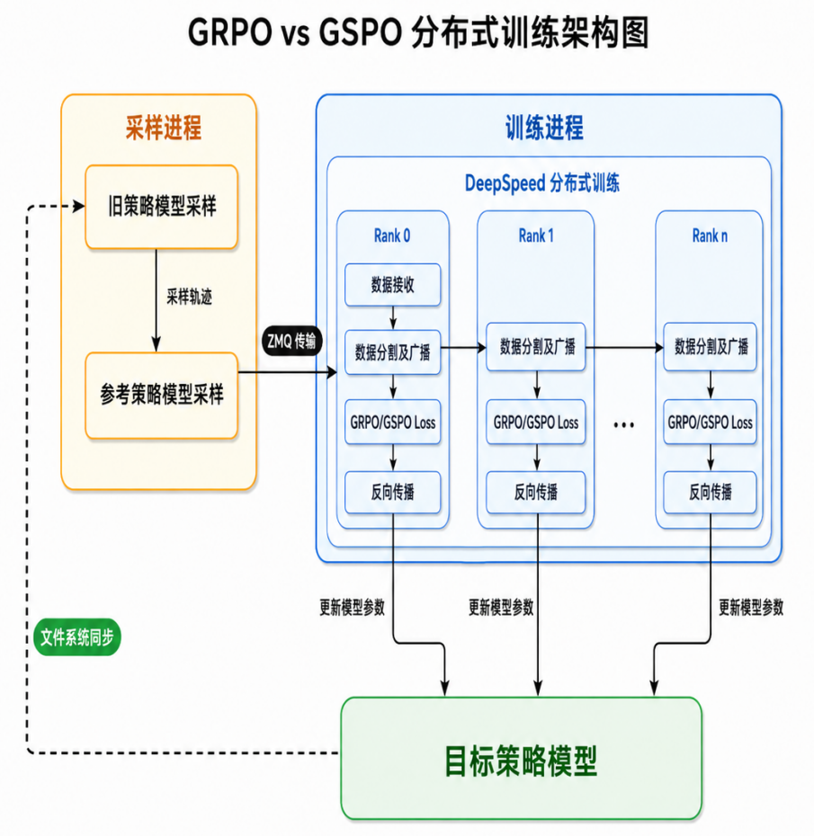
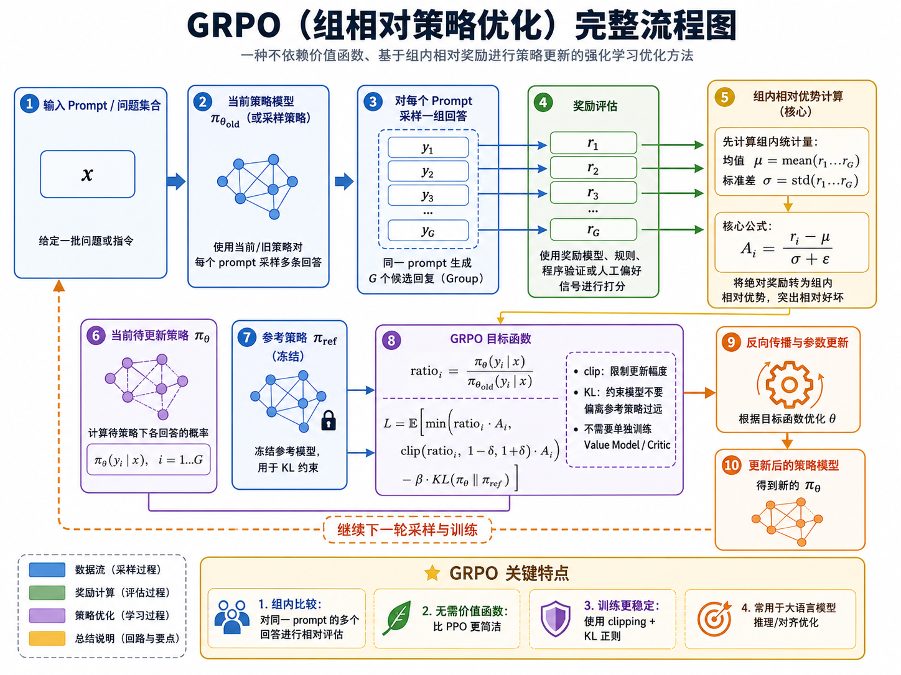
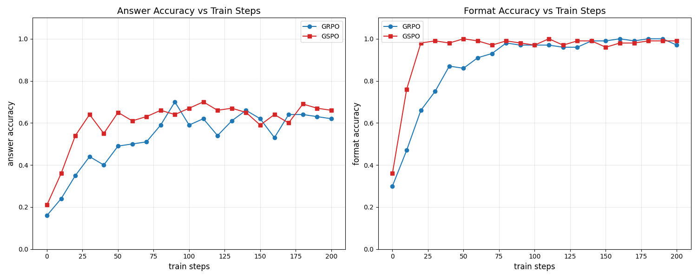
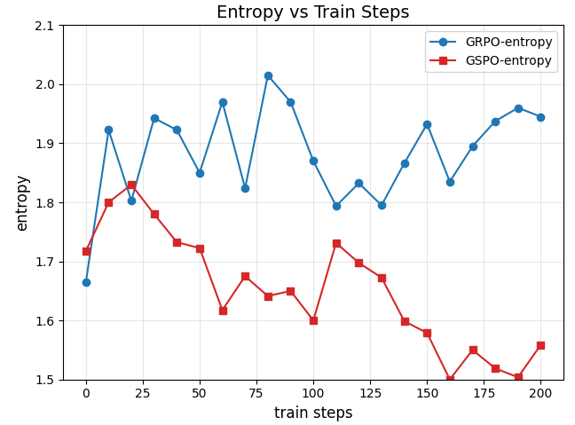
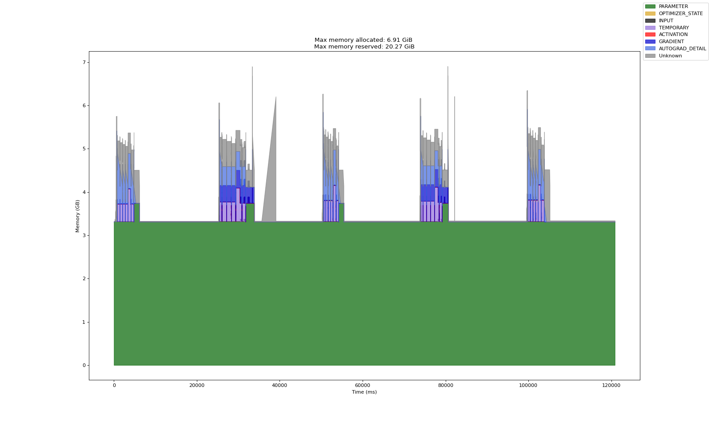
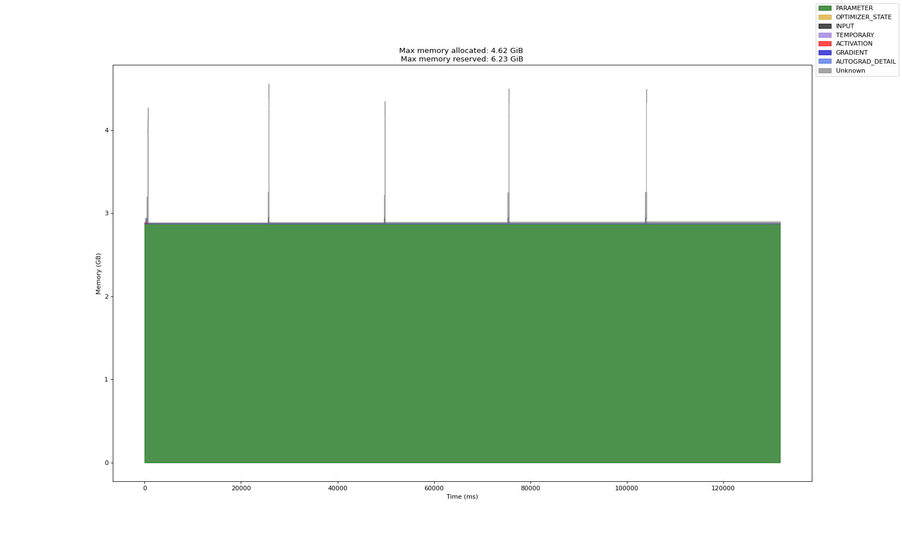
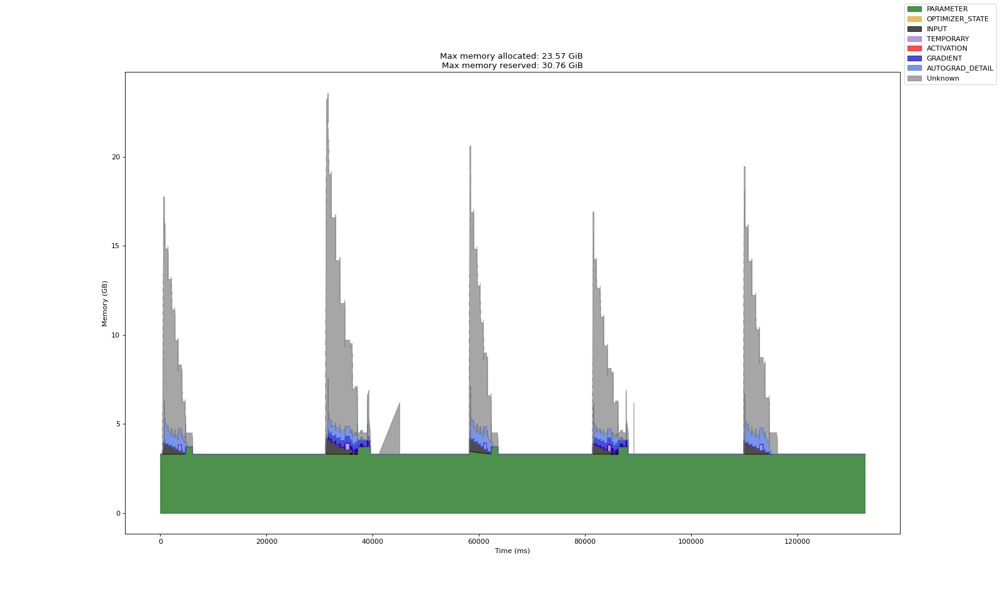

# GRPO vs GSPO

本项目从零实现并对比 [DeepSeekMath GRPO](https://arxiv.org/pdf/2402.03300) 与 [Qwen GSPO](https://arxiv.org/pdf/2507.18071)，使用 Qwen2.5-1.5B-Instruct 在 GSM8K 上进行强化学习微调。项目覆盖旧策略采样、参考策略 KL 约束、新策略训练、组内优势归一化、分布式数据传输和模型参数同步，并同时支持全量微调与 LoRA。

这个仓库重点回答两个问题：

1. 不训练 Critic 的情况下，如何利用同一问题的多条回答构造相对优势并优化语言模型？
2. 将重要性采样从 token 级提升到序列级后，为什么 GSPO 通常比 GRPO 更稳定？

> 本项目面向算法学习和小规模实验复现。训练脚本采用采样、训练双进程设计，适合研究 off-policy 策略优化与 DeepSpeed 分布式训练的组合方式。

## 训练框架


项目主要分为采样进程和训练进程：

* **采样进程**：旧策略生成回答，并分别使用旧策略和参考策略计算所选 token 的对数概率。
* **训练进程**：DeepSpeed 启动多个 rank，主进程接收采样数据，随后将数据广播并按问题组切分到各个 rank。
* **训练数据传递**：采样进程通过 ZeroMQ 将 episode 推送给训练主进程。
* **模型参数同步**：训练进程定期将新策略 checkpoint 写入文件系统，采样进程加载后更新旧策略。

一次训练迭代可以概括为：

```text
问题 x
  └─ 旧策略 π_old 为同一问题生成 G 条回答
       ├─ 计算每条回答的奖励 r(x, y_i)
       ├─ 计算旧策略 log π_old(y_i | x)
       └─ 计算参考策略 log π_ref(y_i | x)
              ↓ ZeroMQ
         组内奖励标准化得到优势 A_i
              ↓
         新策略 π_θ 计算 log π_θ(y_i | x)
              ↓
       GRPO token 级比率 / GSPO 序列级比率
              ↓
         clipped objective + KL penalty
              ↓
           DeepSpeed 更新 π_θ
```

其中三种策略各自承担不同职责：

| 策略 | 作用 | 是否更新 |
| --- | --- | --- |
| 新策略 `π_θ` | 当前正在训练的模型 | 是 |
| 旧策略 `π_old` | 生成轨迹并作为重要性采样分母 | 定期从新策略同步 |
| 参考策略 `π_ref` | 约束模型不要偏离初始能力过远 | 否 |

## GRPO 算法原理



### 1. 从 PPO 到 GRPO

PPO 通常同时训练策略模型（Actor）与价值模型（Critic）。对于大语言模型，额外维护一个同等规模的 Critic 会显著增加显存、计算量和工程复杂度。

GRPO（Group Relative Policy Optimization）的核心做法是：针对同一个问题生成一组共 `G` 条回答，用组内回答的相对奖励估计优势，不再单独训练价值模型。它并不是简单地“用平均奖励代替 Critic”，而是先对组内奖励做中心化和标准化，使高于本组平均水平的回答获得正优势，低于平均水平的回答获得负优势。

对于问题 `x` 的第 `i` 条回答 `y_i`，组内优势为：

```math
\hat{A}_i = \frac{r_i-\mathrm{mean}(r_1,\ldots,r_G)}{\mathrm{std}(r_1,\ldots,r_G)+\varepsilon}
```

这种相对比较具有两个特点：

* 不要求奖励在不同问题之间具有完全一致的绝对尺度。
* 同一组回答如果奖励完全相同，则不会产生有效的相对学习信号。

### 2. token 级重要性采样

轨迹由旧策略生成，而梯度用于更新新策略，因此需要用重要性采样修正两个策略之间的分布差异。GRPO 为回答中的每个 token 分别计算概率比率：

```math
w_{i,t}(\theta) = \frac{\pi_\theta(y_{i,t}\mid x,y_{i,1:t-1})}{\pi_{old}(y_{i,t}\mid x,y_{i,1:t-1})}
```

当比率明显偏离 1 时，表示新旧策略对该 token 的概率判断差距较大。PPO 风格的裁剪会将比率限制在 `1-ε` 到 `1+ε` 附近，避免单个 batch 造成过大的策略更新。

### 3. GRPO 目标函数

目标函数：

```math
J_{\mathrm{GRPO}}(\theta)=\mathbb{E}\left[\frac{1}{G}\sum_{i=1}^{G}\frac{1}{|y_i|}\sum_{t=1}^{|y_i|}\min\left(w_{i,t}(\theta)\hat{A}_i,\mathrm{clip}(w_{i,t}(\theta),1-\epsilon,1+\epsilon)\hat{A}_i\right)\right]
```

这里 `w_{i,t}` 是 token 级重要性采样比率，`A_i` 是第 `i` 条完整回答的组内优势。代码中还加入参考策略 KL 惩罚，用于抑制新策略过度偏离预训练模型：

```math
D_{KL}(\pi_\theta\|\pi_{ref}) \approx \exp(\log\pi_{ref}-\log\pi_\theta)-(\log\pi_{ref}-\log\pi_\theta)-1
```

最终目标由三部分组成：相对优势、裁剪后的重要性采样，以及参考策略 KL 约束。

目标函数和 Loss 函数的核心代码实现：
```python
ref_policy_log_probs_ = ref_policy_log_probs[:, prefix_len-1:] # 参考策略概率分布
old_policy_log_probs_ = old_policy_log_probs[:, prefix_len-1:] # 旧策略概率分布
new_policy_log_probs_ = new_policy_log_probs[:, prefix_len-1:] # 新策略概率分布
attention_mask_       = attention_mask[:, prefix_len:]

importance_ratio = torch.exp(new_policy_log_probs_ - old_policy_log_probs_) # 重要性采样
cliped_ratio = torch.clip(importance_ratio, 1 - clip_epsilon, 1 + clip_epsilon) # 相似度裁剪
importance_term = importance_ratio * advantages
clip_term = cliped_ratio * advantages

kl_term = torch.exp(ref_policy_log_probs_ - new_policy_log_probs_) - (ref_policy_log_probs_ - new_policy_log_probs_) - 1 # kl散度

objective_function = torch.min(importance_term, clip_term) - kl_beta * kl_term # 目标函数
per_token_loss = -objective_function # loss函数

loss = ((per_token_loss * attention_mask_).sum(dim=1) / attention_mask_.sum(dim=1)).mean() # batch的均值作为最终loss(只统计有效token的loss)
```

## GSPO 算法原理

### 1. 为什么需要序列级优化

GRPO 的奖励和优势属于整条回答：数学题回答正确或错误，是对完整序列的评价；但 GRPO 的重要性采样和裁剪发生在 token 级。也就是说，同一个序列共享一个优势值，却可能有数百个不同的 token 比率和裁剪结果。这种粒度不一致会放大 token 间方差，长序列和 MoE 路由变化时尤其明显。

GSPO（Group Sequence Policy Optimization）保留组内相对优势，但将新旧策略的比率聚合为一个序列级比率。一条回答只产生一个重要性权重，并直接与该回答的序列奖励对齐。

### 2. 序列级重要性采样

完整序列概率是所有生成 token 条件概率的乘积。直接连乘容易数值下溢，而且会让比率随序列长度呈指数变化，因此 GSPO 在 log 空间求平均，再通过指数函数还原。这等价于 token 概率比率的几何平均：

```math
s_i(\theta)=\exp\left(\frac{1}{|y_i|}\sum_{t=1}^{|y_i|}\log\frac{\pi_\theta(y_{i,t}\mid x,y_{i,1:t-1})}{\pi_{old}(y_{i,t}\mid x,y_{i,1:t-1})}\right)
```

其中 `s_i(θ)` 表示第 `i` 条回答的序列级重要性采样比率。除以有效序列长度后，不同回答长度之间更容易比较，并且 `s_i(θ)` 与序列级组内优势 `A_i` 在粒度上保持一致。

### 3. GSPO 目标函数与特点

GSPO 对每条序列的单一比率进行裁剪：如果序列级比率仍在信任区域内，则按照优势更新；如果偏移过大，则使用裁剪后的比率限制更新幅度。

```math
J_{\mathrm{GSPO}}(\theta)=\mathbb{E}\left[\frac{1}{G}\sum_{i=1}^{G}\min\left(s_i(\theta)\hat{A}_i,\mathrm{clip}(s_i(\theta),1-\epsilon,1+\epsilon)\hat{A}_i\right)\right]
```

相较 GRPO，GSPO 的主要特点是：

* **奖励与采样比率对齐**：两者都处于序列级，不再把一个序列奖励分别作用于大量独立 token 比率。
* **降低方差**：几何平均减弱了少数极端 token 对整条序列更新的影响。
* **长度归一化**：log 比率除以有效生成长度，降低回答长度对重要性权重尺度的影响。
* **更适合 MoE**：序列级似然比能够对路由差异进行边缘化处理，减少对 routing replay 的依赖。

### 4. GRPO 与 GSPO 对比

| 对比项 | GRPO | GSPO |
| --- | --- | --- |
| 组内优势 | 序列级 | 序列级 |
| 重要性采样 | token 级 | 序列级 |
| 裁剪粒度 | 每个 token 独立裁剪 | 每条回答裁剪一次 |
| 序列长度处理 | 对有效 token loss 求平均 | 对 log 比率按长度归一化 |
| 更新方差 | 更容易受极端 token 影响 | 通常更低、更稳定 |
| MoE 路由 | 可能需要额外处理路由变化 | 序列级比率更易兼容 |

两种方法并不存在对所有任务都绝对成立的优劣关系。GSPO 的主要优势是优化粒度更一致、训练通常更稳定；GRPO 则保留更细粒度的 token 更新信号。在实际任务中仍需要结合奖励曲线、KL、裁剪比例、输出熵和最终准确率共同判断。

目标函数和 Loss 函数的核心代码实现：
```python
batch_size = ref_policy_log_probs.shape[0]

# 取生成部分的概率分布
ref_policy_log_probs_ = ref_policy_log_probs[:, prefix_len-1:] # token_0裁剪了, 因此需要裁剪的长度为prefix_len-1
old_policy_log_probs_ = old_policy_log_probs[:, prefix_len-1:]
new_policy_log_probs_ = new_policy_log_probs[:, prefix_len-1:]
attention_mask_       = attention_mask[:, prefix_len:]         # attention_mask维度中token_0的位置没裁剪, 因此需要裁剪的长度为prefix_len

# 计算有效序列, 遮掩pad_token
valid_seq_len = attention_mask_.sum(dim=1)
new_old_log_probs_ = (new_policy_log_probs_ - old_policy_log_probs_) * attention_mask_
ref_new_log_probs_ = (ref_policy_log_probs_ - new_policy_log_probs_) * attention_mask_

# 序列级别的重要性采样
importance_ratio = torch.exp(new_old_log_probs_.sum(dim=1) / valid_seq_len).view(batch_size, 1) # batch_size * 1
cliped_ratio = torch.clip(importance_ratio, 1 - clip_epsilon, 1 + clip_epsilon) # batch_size * 1
importance_term = importance_ratio * advantages # batch_size * 1
clip_term = cliped_ratio * advantages # batch_size * 1

kl_term = torch.exp(ref_new_log_probs_.sum(dim=1) / valid_seq_len) - (ref_new_log_probs_.sum(dim=1) / valid_seq_len) - 1
kl_term = kl_term.view(batch_size, 1)

objective_function = torch.min(importance_term, clip_term) - kl_beta * kl_term
sequence_loss = -objective_function

# 批次平均损失作为总损失
loss = sequence_loss.mean()
```

## 数据集
GSM8K数据集是由8.5K个高质量的小学数学问题组成的语言模型训练数据集. 每个问题包含"question"和"answer"两个字段, answer中给出了问题的推理过程和最终的答案. 单个数据示例如下所示:

```
question: Natalia sold clips to 48 of her friends in April, and then she sold half as many clips in May. How many clips did Natalia sell altogether in April and May?
answer: Natalia sold 48/2 = <<48/2=24>>24 clips in May.
Natalia sold 48+24 = <<48+24=72>>72 clips altogether in April and May.
#### 72
```

### 对话格式
在提示词中要求模型回复中需要包含思考过程和答案
* 思考过程需要用标签\<think\>(思考过程)\</think\>标记
* 答案需要用标签\<answer\>(答案)\</answer\>标记

### 奖励函数
* 答案奖励: 答案正确奖励+1, 错误奖励-1
* 格式奖励: 格式正确奖励+1.25, 错误奖励-1

## 效果展示
* 参考模型: qwen2.5-1.5B-Instruct
* 目标模型: qwen2.5-1.5B-Instruct
* 硬件配置: 3 × AutoDL vGPU-32G (GPU0/1用于训练, GPU2用于采样)
* 训练步数: 200 steps (60min)


准确率评估包含答案和格式两部分:

* GSPO算法在50个训练步左右基本稳定并到达峰值, 答案准确率为0.6左右, 格式准确率为0.99左右
* GRPO算法在120个训练步左右基本稳定并到达峰值, 答案准确率为0.6左右, 格式准确率为0.99左右

从结果来看GSPO训练速度明显优于GRPO, 消耗更少的时间达到稳定状态. 从模型特性来解释, GSPO模型训练时方差更小, 在矫正输出分布时有更强的确定性能够快速调整, 宏观上体现为更快得收敛至稳定值. 训练至200步后两种方法训练的结果基本接近, 应该是达到模型极限.



也可以从熵的角度来对比训练结果, 熵表示概率分布多样化的程度, 分布越分散熵越大. 从上面图中可以看到, 在200步的训练过程中, GSPO相比于GRPO的输出序列平均熵降低更快. 说明在微调任务中GSPO能够更快逐渐趋于某个人类偏好. 单纯看熵并不能直接说明方法的优劣, 只能说明分布的分散程度, 可以用熵结合reward来对比评估方法.

### LoRA
本项目应用了LoRA技术进行显存优化, 相对于全量微调显存占用极大减少, 梯度及优化器参数约为全量的3%. 单卡batch_size=4, 全量微调和LoRA微调的显存占用情况为:
<table>
<tr>
<td></td>
<td></td>
</tr>
<tr>
<td align="center">全量微调显存占用</td>
<td align="center">LoRA微调显存占用</td>
</tr>
</table>

## 项目部署
```python
# config.yaml
# 用grpo算法训练
training:
  use_gspo: false
# 用gspo算法训练
training:
  use_gspo: true
```

```bash
# 依赖安装
pip install -r requirements.txt
# GSM8K数据集下载
git clone https://huggingface.co/datasets/openai/gsm8k
# Qwen2.5-1.5B-Instruct模型下载(huggingface)
git clone https://huggingface.co/Qwen/Qwen2.5-1.5B-Instruct
# Qwen2.5-1.5B-Instruct模型下载(modelscope)
git clone https://www.modelscope.cn/Qwen/Qwen2.5-1.5B-Instruct.git
# 启动采样进程
python sampling_worker.py
# 启动训练进程
CUDA_VISIBLE_DEVICES=0,1 deepspeed --num_gpus=2 training_worker.py
```

## 踩坑记录
* 工程上实现的生成序列包含人为填充的pad token, 需要将pad token去掉计算有效序列的概率分布, 防止引入无意义的概率噪声.
* AutoDL vGPU进行分布式训练时后台通信不能用默认的nccl, 需要改为gloo, nccl仅支持物理GPU的通信.
* off policy方法涉及到旧策略、新策略等多个模型, 通常采样与训练分布不同进程中, 采样数据传输到训练进程后需要手动进行数据并行, 给deepspeed fork的各子进程手动分配数据, 否则会造成单卡数据过多且重复.
* 从训练进程同步模型参数至采样进程时仅在主进程中传递即可, 否则会重复传递造成资源浪费.
* LLM进行RLHF训练微调时若需要同步模型参数, 可以用文件系统实现. LLM通常参数量较大, 若用网络传递速度较慢且容易失败.
* 在训练模式下前向传播时显存占用过高, 显存占用会出现一个尖峰, 非常容易OOM, 解决方法是在加载模型时开启Gradient Checkpoint `model.gradient_checkpointing_enable()`. 具体表现如下图所示, 开启前峰值显存约为17GB左右, 开启后5GB左右, 有效地防止了OOM的现象, 同时也允许更大的batch_size.
* LoRA微调时需要更大的步长, 比如: 2e-4. 用LoRA训练时参数被约束在一个低秩子空间, 在受限的空间中找到最优解相对于全量微调需要更多的迭代步骤, 因此可以考虑更大的步长加快收敛.

<table>
<tr>
<td></td>
<td></td>
</tr>
<tr>
<td align="center">未开启Gradient Checkpointing</td>
<td align="center">开启Gradient Checkpointing</td>
</tr>
</table>

## 参考资料
本项目基于以下优秀项目实现, 在此进行感谢
* [GRPO论文](https://arxiv.org/pdf/2402.03300) 提供了理论基础, 组内相对奖励的设计极大的减少了训练开销.
* [GSPO论文](https://arxiv.org/pdf/2507.18071) 提供了理论基础, 序列重要性采样与序列reward进行颗粒度对齐稳定了训练过程并提升训练效率.
* [GRPO-Zero](https://github.com/policy-gradient/GRPO-Zero) 用清晰的代码逻辑实现了GRPO方法, 并且手搓transformer网络、qwen模型结构和AdamW, 是一份非常优秀的示例代码.
* [simple_GRPO](https://github.com/lsdefine/simple_GRPO) 提供了采样-训练双进程实现的思路, 并且以非常简介的形式复现了GRPO方法.
* [Qwen2.5](https://huggingface.co/Qwen/Qwen2.5-3B-Instruct) 提供了高质量的qwen系列预训练模型.
* [GSM8K](https://huggingface.co/datasets/openai/gsm8k) 提供了高质的问答数据.
